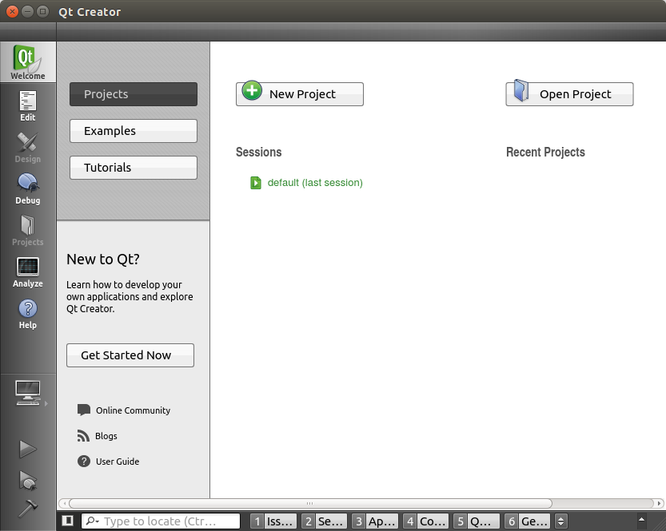
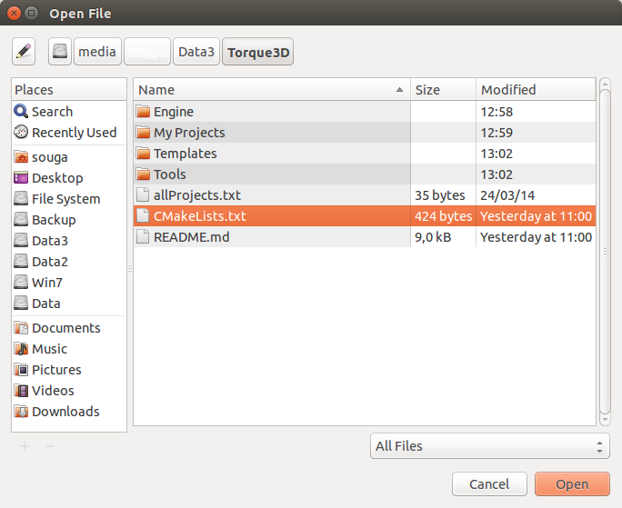
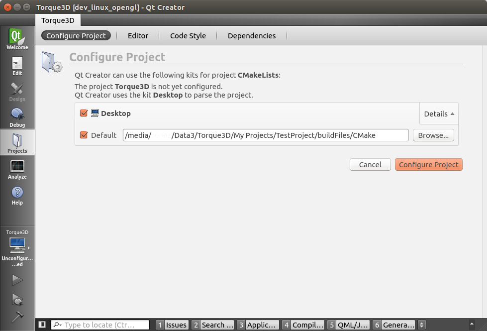
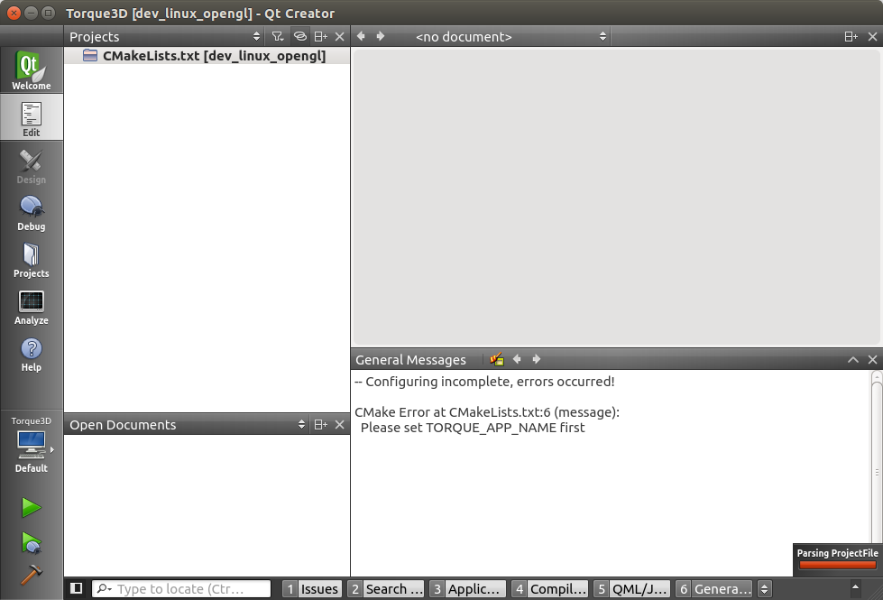
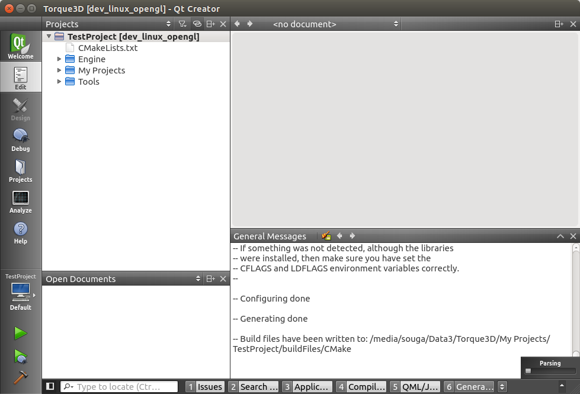
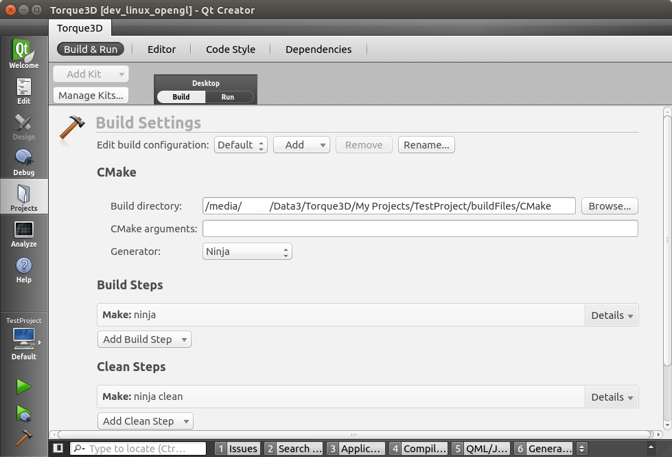
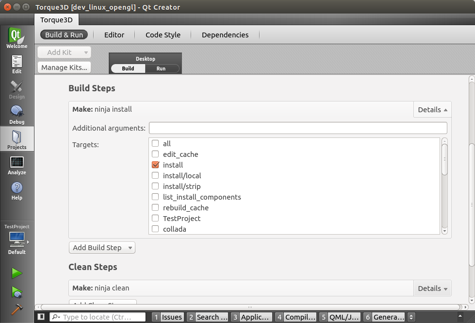
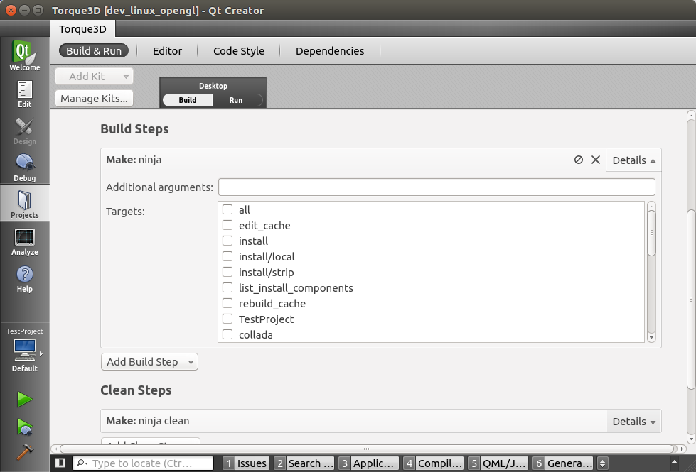
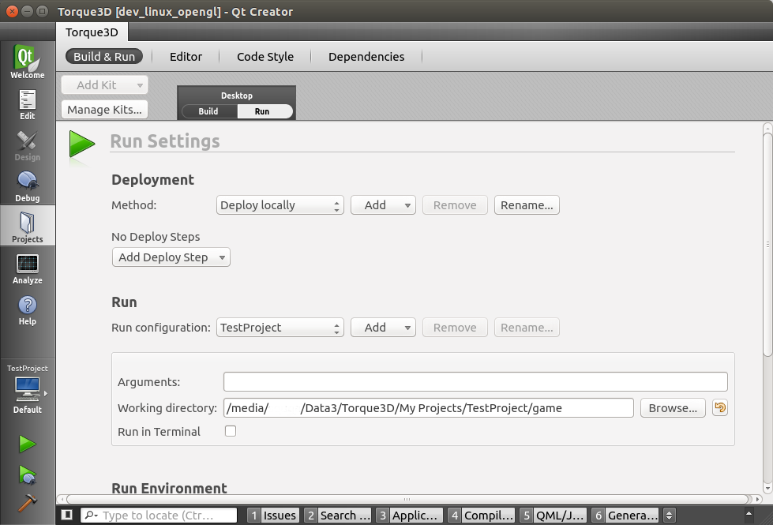
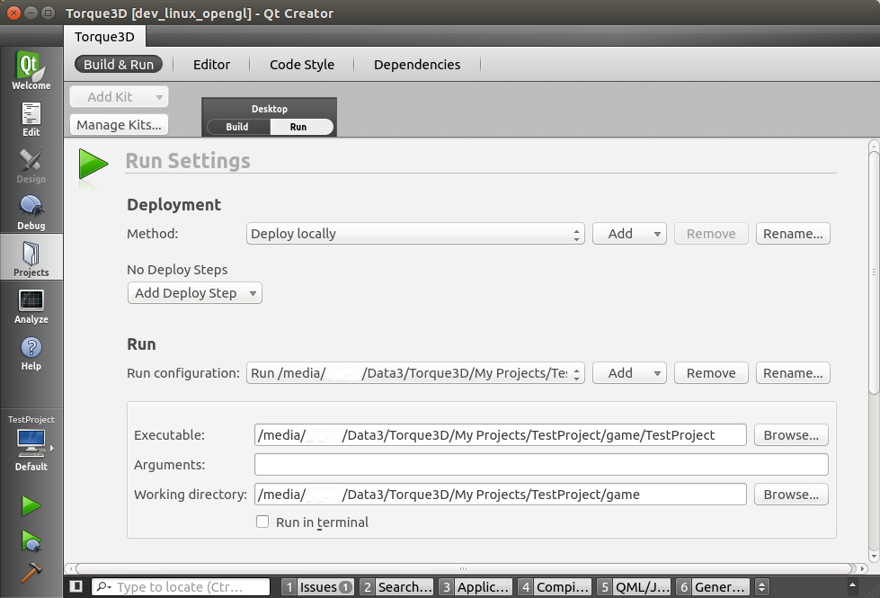

Compiling Torque 3D with qtCreator
-----------------------------

* Open qtCreator

* On MenuBar -> File -> Open File or Project (Ctrl+O)
* Open file CMakeList.txt on root Torque3D directory.

* `ProjectName` will be used later, and you have to choose one to use the same in the following steps. For example: `TestProject`
* Change path to: `Torque3D path` + `/My Projects/` + `ProjectName` + `/buildFiles/CMake`.
 For example: `/media/XXXXX/Data3/Torque3D/My Projects/TestProject/buildFiles/CMake`
* Click `Configure Project` button.

* We will see this error message. Is normal, we have to set the name of the project.

* Open CMake gui and [configure](Use_CMake_project_generator.md) using same dir paths and Ninja generator.
* Return to qtCreator.
* On menu bar -> `Build` -> `Run CMake`

* Switch to 'Projects`mode (CTRL+5)

* On Build steps, select target `install`. `install` build all projects and then copy template files on your game dir. Only ONCE, unselect for next builds.

* On menu bar -> `Build` -> `Build all`
* On build/install finish, unselect target `install`

* Switch to 'Projects`mode (CTRL+5)
* Change to `Run Settings`.

* On run configuration -> `Add` -> `Custom Executable`
* Set `Executable` and `Working directory`

* Select and `Remove` default `Run configuration`. For example: `TestProject`
* That's all :D
